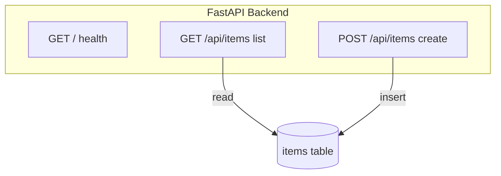
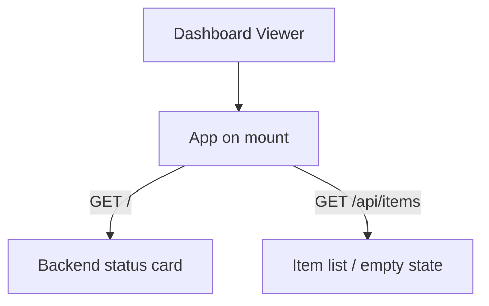

# KCE_Demo

## Functional Requirements Document

| | |
|---|---|
| **Version** | 1.0 |
| **Date** | June 26, 2026 |
| **Source** | Breeze.AI Functional Graph — 2 personas, 2 outcomes, 5 scenarios, 5 steps, 5 actions |

---

## Table of Contents

1. [Document Overview](#1-document-overview)
2. [Project Context](#2-project-context)
3. [Persona Summary](#3-persona-summary)
4. [FR-001 — System](#4-fr-001--system)
   - 4.1 [Serve Item Catalog API](#system-serve-item-catalog-api)
5. [FR-002 — Dashboard Viewer](#5-fr-002--dashboard-viewer)
   - 5.1 [Monitor Item Dashboard](#dashboard-viewer-monitor-item-dashboard)
6. [Source Documents](#6-source-documents)
7. [Non-Functional Requirements](#7-non-functional-requirements)
8. [Glossary](#8-glossary)

---

## 1. Document Overview

KCE_Demo is a three-tier reference application: a React/Vite single-page dashboard, a FastAPI service, and a PostgreSQL database, wired together over a small REST surface. The dashboard reads backend health and the current item catalog on load; the service exposes three endpoints that report health and list or create catalog items backed by a single 'items' table. The functional graph captures two actors: the Dashboard Viewer who consumes the read-only dashboard, and the System that owns the API and persistence. Scope is deliberately narrow, this is a demo stack, not a production product.

| | |
|---|---|
| **Personas** | 2 |
| **Outcomes** | 2 |
| **Scenarios** | 5 |
| **Steps** | 5 |
| **Actions** | 5 |

---

## 2. Project Context

### Key Business Objectives

1. Demonstrate an end-to-end React + FastAPI + PostgreSQL slice that runs fully offline via Docker Compose
2. Expose a minimal REST contract (health, list items, create item) that the frontend consumes directly
3. Persist catalog items durably in PostgreSQL through SQLAlchemy
4. Surface backend connectivity status to the user on dashboard load

### Key Stakeholders

| Role | Interest |
|------|----------|
| Dashboard Viewer | Wants to see at a glance whether the backend is reachable and what items currently exist, without any edit controls. |
| System | Owns the REST contract and the items table; responsible for serving reads, accepting writes, and reporting health. |

### Key Capabilities

- Backend health reporting via GET /
- Paginated item listing via GET /api/items (skip/limit)
- Item creation via POST /api/items (name, description)
- Read-only dashboard rendering of status and item list with empty-state handling
- PostgreSQL persistence of the items table through SQLAlchemy

---

## 3. Persona Summary

| ID | Persona | Outcomes | Primary Responsibilities |
|----|---------|----------|--------------------------|
| FR-001 | System | 1 | The FastAPI backend service. Exposes the REST contract, owns the SQLAlchemy-mapped 'items' table in PostgreSQL, and reports its own liveness. |
| FR-002 | Dashboard Viewer | 1 | An end user of the React/Vite SPA. Opens the dashboard to view backend connectivity and the current catalog; the UI exposes no create or edit controls. |

---

## 4. FR-001 — System

The FastAPI backend service. Exposes the REST contract, owns the SQLAlchemy-mapped 'items' table in PostgreSQL, and reports its own liveness.

### 4.1 Serve Item Catalog API <a href="#src-2" style="text-decoration:none;color:#6366f1;font-size:0.65em;vertical-align:super;">²</a>

Provides the entire server-side contract the demo depends on: a liveness signal, a paginated read path, and a single write path, all backed by durable PostgreSQL storage.

- **SC-01 Create a catalog item** <a href="#src-2" style="text-decoration:none;color:#6366f1;font-size:0.65em;vertical-align:super;">²</a>

    create_item handles POST /api/items with query params name and description. Opens a DB session, inserts a new Item row into the 'items' table, commits, refreshes, and returns the persisted row with its generated id.

    - **Step 1: Persist new item**
        - → Insert item row and return persisted entity
- **SC-02 Report backend health** <a href="#src-2" style="text-decoration:none;color:#6366f1;font-size:0.65em;vertical-align:super;">²</a>

    read_root handles GET / and returns a static {status: ok, message} payload with no DB access. Used as a liveness/health check.

    - **Step 1: Handle health check request**
        - → Return service health status
- **SC-03 List items from the catalog** <a href="#src-2" style="text-decoration:none;color:#6366f1;font-size:0.65em;vertical-align:super;">²</a>

    read_items handles GET /api/items with query params skip (default 0) and limit (default 100). Opens a DB session via get_db dependency, queries the 'items' table (columns: id, name, description) with offset/limit pagination, returns the list.

    - **Step 1: Receive paginated list request**
        - → Read items with offset/limit pagination

---

## 5. FR-002 — Dashboard Viewer

An end user of the React/Vite SPA. Opens the dashboard to view backend connectivity and the current catalog; the UI exposes no create or edit controls.

### 5.1 Monitor Item Dashboard <a href="#src-1" style="text-decoration:none;color:#6366f1;font-size:0.65em;vertical-align:super;">¹</a>

Gives the user a single read-only view that confirms backend connectivity and shows the current item catalog, with an explicit empty state when no items exist.

- **SC-01 View items from the database** <a href="#src-1" style="text-decoration:none;color:#6366f1;font-size:0.65em;vertical-align:super;">¹</a>

    On mount, App fetches GET http://localhost:8000/api/items and renders each item as a list entry showing name (bold) and description. When the list is empty it renders 'No items found.'

    - **Step 1: Load and render item list**
        - → Fetch items and render list with empty state
- **SC-02 View backend connection status** <a href="#src-1" style="text-decoration:none;color:#6366f1;font-size:0.65em;vertical-align:super;">¹</a>

    On mount, App fetches GET http://localhost:8000/ and shows the returned message in a 'Backend Status' card. On fetch failure it shows 'Error connecting to backend'. Initial state is 'Loading...'.

    - **Step 1: Load dashboard and resolve backend status**
        - → Fetch and display backend health message

---

## 6. Source Documents

| # | Document |
|---|----------|
| 1 | App.jsx |
| 2 | main.py |

---

## 7. Non-Functional Requirements

*Non-functional requirements should be defined based on the project's specific needs.*

---

## 8. Glossary

*Glossary terms should be defined based on the project's domain vocabulary.*

---

*Generated on June 26, 2026 by Breeze.AI*
