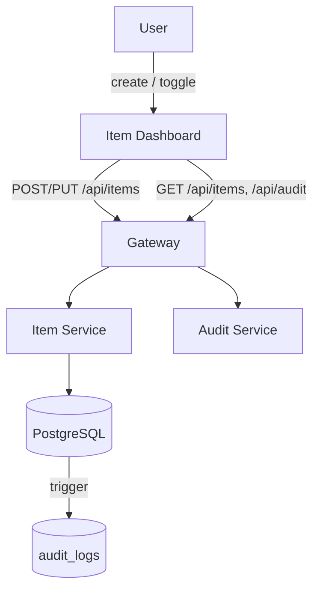
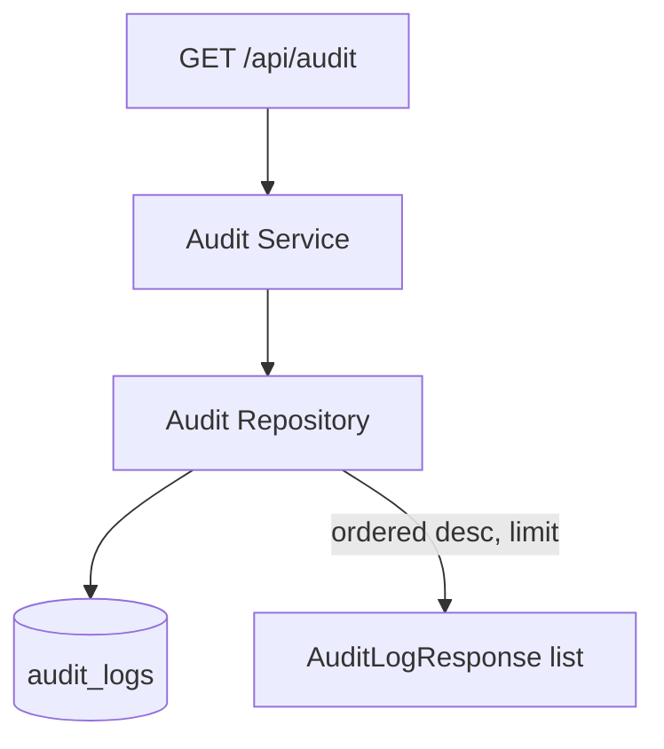
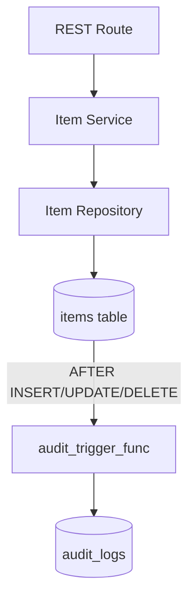
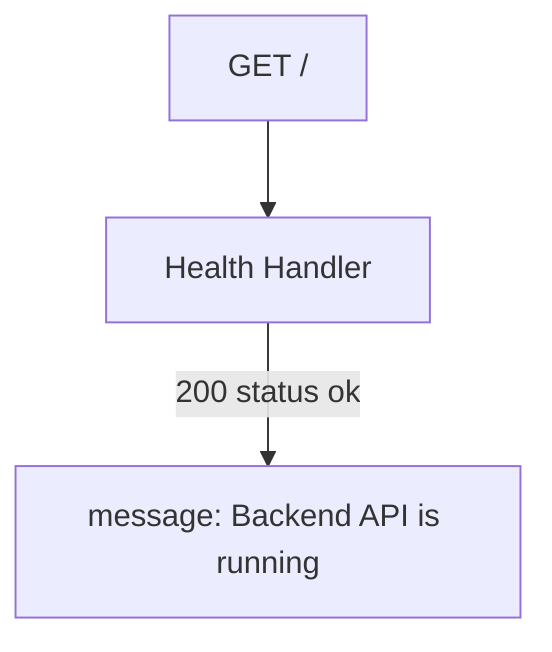
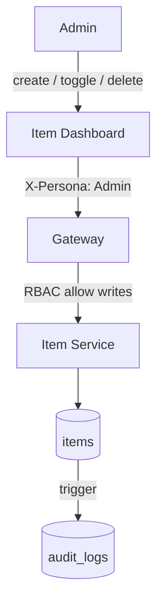
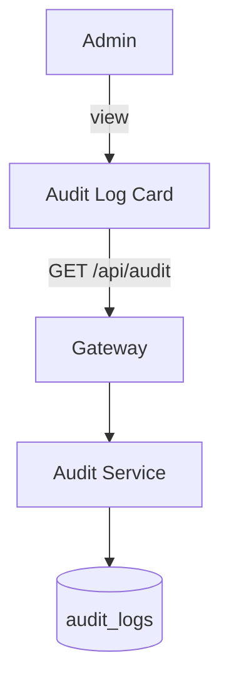
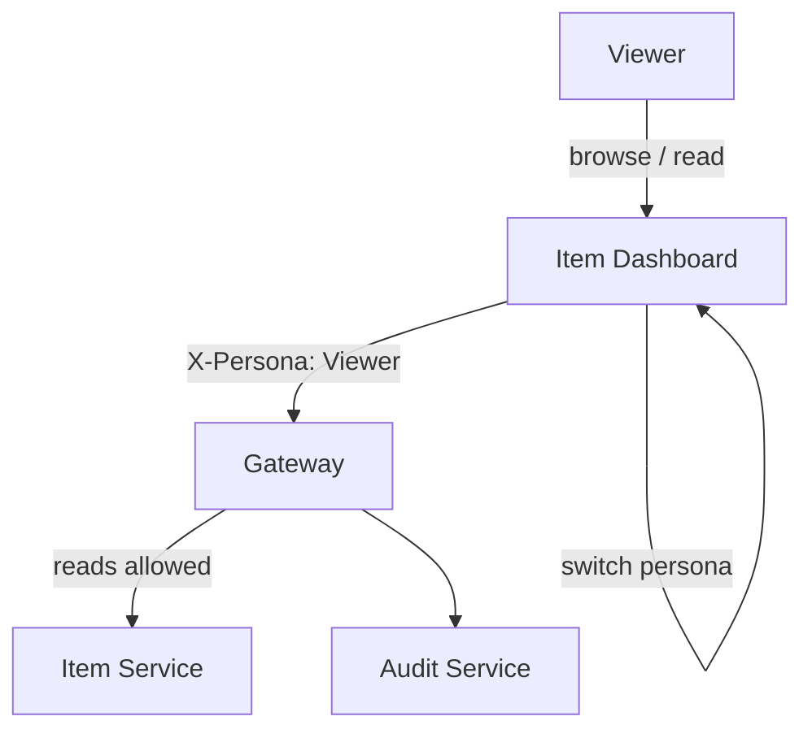

# KCE_Demo_Rebuild

## Functional Requirements Document

| | |
|---|---|
| **Version** | 1.0 |
| **Date** | June 27, 2026 |
| **Source** | Breeze.AI Functional Graph — 4 personas, 7 outcomes, 22 scenarios, 52 steps, 84 actions |

---

## Table of Contents

1. [Document Overview](#1-document-overview)
2. [Project Context](#2-project-context)
3. [Persona Summary](#3-persona-summary)
4. [FR-001 — User](#4-fr-001--user)
   - 4.1 [Manage Items](#user-manage-items)
5. [FR-002 — System](#5-fr-002--system)
   - 5.1 [Monitor System Audit Activity](#system-monitor-system-audit-activity)
   - 5.2 [Manage Items](#system-manage-items)
   - 5.3 [Monitor System Health](#system-monitor-system-health)
6. [FR-003 — Admin](#6-fr-003--admin)
   - 6.1 [Manage Items](#admin-manage-items)
   - 6.2 [Review Audit Logs](#admin-review-audit-logs)
7. [FR-004 — Viewer](#7-fr-004--viewer)
   - 7.1 [Monitor Items and Audit Activity](#viewer-monitor-items-and-audit-activity)
8. [Source Documents](#8-source-documents)
9. [Non-Functional Requirements](#9-non-functional-requirements)
10. [Glossary](#10-glossary)

---

## 1. Document Overview

KCE_Demo_Rebuild is a single-page item-management application split across a React frontend and a service-oriented backend (gateway, item service, audit service, PostgreSQL with trigger-based audit capture). The frontend sends an X-Persona header (Admin, User, Viewer) on every request; the gateway enforces role-based access on writes. Admin gets full create/update/delete; User can create and toggle completion but not delete; Viewer is read-only. All write operations are recorded automatically in an immutable audit trail that every persona can read.

The functional graph captures both halves: the human-facing personas (Admin, User, Viewer) driving the UI, and the System persona representing the backend handlers (REST routes, repositories, DB triggers). Each UI action is linked to the REST call it issues, giving end-to-end traceability from a button click to the gateway endpoint and the audit row it produces.

| | |
|---|---|
| **Personas** | 4 |
| **Outcomes** | 7 |
| **Scenarios** | 22 |
| **Steps** | 52 |
| **Actions** | 84 |

---

## 2. Project Context

### Key Business Objectives

1. Enforce role-based access at the gateway so write permissions follow the active persona, not client trust
2. Guarantee an immutable, automatically captured audit trail for every data mutation via database triggers
3. Keep the read path open to all personas so items and audit activity stay observable
4. Maintain a single dashboard surface that adapts its controls to the caller's role
5. Preserve end-to-end traceability from UI action to REST endpoint to audit record

### Key Stakeholders

| Role | Interest |
|------|----------|
| Admin | Full lifecycle control over items (create, update status, delete) plus visibility into the complete audit trail |
| User | Day-to-day item creation and completion tracking without destructive delete rights |
| Viewer | Read-only oversight of item state and audit activity for monitoring and review |
| System | Correct handler behavior: input validation, existence checks, persistence, and trigger-based audit capture on every mutation |

### Key Capabilities

- Persona-scoped RBAC enforced at the gateway via X-Persona header
- Item CRUD with client-side validation and server-side existence checks
- Completion-status toggling with immediate list refresh
- Automatic audit capture through PostgreSQL AFTER-INSERT/UPDATE/DELETE triggers
- Open audit-log read access across all personas
- Gateway health/status surfacing on the dashboard
- Live persona switching that re-scopes data under the new role

---

## 3. Persona Summary

| ID | Persona | Outcomes | Primary Responsibilities |
|----|---------|----------|--------------------------|
| FR-001 | User | 1 | Standard role. Can create items and toggle completion status, but the delete control is hidden; retains full read access to items and audit logs. |
| FR-002 | System | 3 | Mechanical backend persona representing the gateway, item service, audit service, and database handlers that validate, persist, and audit each request. |
| FR-003 | Admin | 2 | Full-access role. Sees and uses every control on the dashboard: add form, completion toggle, and the Admin-only delete button, plus the audit log. |
| FR-004 | Viewer | 1 | Read-only role. The add form and all row-level write controls are hidden; can browse items, watch gateway status, and read the audit trail. |

---

## 4. FR-001 — User

Standard role. Can create items and toggle completion status, but the delete control is hidden; retains full read access to items and audit logs.

### 4.1 Manage Items

Gives the standard User the full non-destructive item workflow: create, browse, toggle completion, and read the audit log. This is the primary day-to-day surface and the bulk of UI interaction.

- **SC-01 Create a new item**

    User fills in the item name and description and submits the form to create a new item. Both fields are required; blank values are rejected client-side before the request is sent. The form is visible to non-Viewer personas; User has access.

    - **Step 1: Specify the new item details**
        - → Enter the item name
        - → Enter the item description
    - **Step 2: Submit the new item**
        - → Submit the new item to the server
- **SC-02 Mark an item as complete or incomplete**

    User selects the Complete or Undo control on an item row to toggle its completion state. The control label reflects the item's current state ('Complete' when incomplete, 'Undo' when complete). Available to non-Viewer personas; User has access.

    - **Step 1: Choose the completion state to apply**
        - → Indicate whether to complete or undo the item
    - **Step 2: Submit the updated completion status**
        - → Submit the updated completion status to the server
- **SC-03 View the item list and gateway status**

    User lands on the Item Management page and reviews all items stored in the database, with each item showing its name, description, and completion state. The gateway connection status is displayed at the top. Data loads automatically on page open and reloads whenever the active persona changes.

    - **Step 1: Load page data on open**
        - → Select the active persona for all requests
        - → Request the item list from the server
        - → Request the gateway health status
    - **Step 2: Review the gateway status and item list**
        - → Observe the gateway connection status
        - → Observe each item's name
        - → Observe each item's description
        - → Observe each item's completion state
- **SC-04 Review the audit log**

    User views the audit log section displaying all recorded system actions with their timestamp, action type, affected table name, and affected record ID. The log is loaded automatically on page open and refreshed after each item mutation.

    - **Step 1: Load the audit log from the server**
        - → Request the audit log entries from the server
    - **Step 2: Review each audit log entry**
        - → Observe each log entry's timestamp
        - → Observe each log entry's action type
        - → Observe each log entry's affected table
        - → Observe each log entry's affected record ID
- **SC-05 Update an item's completion status**

    User toggles the completion status of a listed item. An active item shows 'Complete' and a completed item shows 'Undo'. The status update is immediate and the item list refreshes.

    - **Step 1: Indicate the desired completion state**
        - → Indicate whether to mark the item as complete or incomplete
    - **Step 2: Submit the completion status update**
        - → Submit the completion status update
- **SC-06 Add a new item**

    User fills in a name and description in the creation form and submits. Both fields are trimmed and validated for non-empty content before the request is sent. On success the form clears and the item list refreshes.

    - **Step 1: Specify item details**
        - → Provide item name
        - → Provide item description
    - **Step 2: Submit the new item**
        - → Submit the new item
- **SC-07 Browse and monitor the item list**

    On page load the application automatically checks backend health (GET http://localhost:8000/) and fetches all stored items (GET http://localhost:8000/api/items). Items display name, description, and completion state. An empty state shows 'No items found.'

    - **Step 1: Observe the application status**
        - → Observe the backend connection status
    - **Step 2: Review items in the list**
        - → Observe item name
        - → Observe item description
        - → Observe item completion state
- **SC-08 Remove an item from the list**

    User permanently removes a listed item from the database. The item list refreshes immediately after deletion.

    - **Step 1: Remove the item**
        - → Delete the item

---

## 5. FR-002 — System

Mechanical backend persona representing the gateway, item service, audit service, and database handlers that validate, persist, and audit each request.

### 5.1 Monitor System Audit Activity

Exposes the recorded audit trail through the audit service. Turns the trigger-captured rows into a readable, chronological feed for oversight.

- **SC-01 Retrieve audit log entries**

    AuditService.get_audit_logs(limit) delegates to AuditRepository.get_logs(limit), which executes db.query(AuditLog).order_by(AuditLog.created_at.desc()).limit(limit).all() against the audit_logs table. The limit parameter defaults to 50. No authentication guard is applied. Each AuditLog ORM row is serialized to AuditLogResponse and returned as a list.

    - **Step 1: Receive request**
        - → Receive GET /api/audit
    - **Step 2: Query audit logs**
        - → Query audit log records
    - **Step 3: Return response**
        - → Serialize audit log response

---

### 5.2 Manage Items

Backend item CRUD with existence validation and trigger-driven audit capture. Ensures every create, update, and delete is persisted correctly and recorded, independent of which UI persona initiated it.

- **SC-01 Delete item by ID with existence validation**

    System receives DELETE /api/items/{item_id}, queries ItemRepository.get_by_id against the items table (db.query(Item).filter(Item.id == item_id).first()), raises HTTPException 404 with detail 'Item not found' if absent, otherwise calls ItemRepository.delete to execute db.delete(item) + db.commit() on the items table. The PostgreSQL trigger audit_items_trigger fires AFTER DELETE FOR EACH ROW and executes audit_trigger_func() which INSERTs into audit_logs (action='DELETE', record_id=OLD.id, created_at=NOW()). Returns HTTP 200 {"status": "ok"} on success.

    - **Step 1: Receive delete request**
        - → Receive DELETE /api/items/{item_id}
    - **Step 2: Validate item existence**
        - → Query item by ID
        - → Reject missing item
    - **Step 3: Delete item record**
        - → Delete item from items table
        - → Insert audit log entry via database trigger
    - **Step 4: Return success response**
        - → Return deletion confirmation
- **SC-02 Update an item's completion status**

    System receives PUT /api/items/{item_id} with path param item_id (int) and query param completed (bool). ItemService.update_item_status fetches the item via ItemRepository.get_by_id (SELECT FROM items WHERE id = item_id); raises HTTPException(status_code=404, detail='Item not found') if the record is absent. If found, calls ItemRepository.update_status which sets item.completed = completed and calls db.commit() + db.refresh() (UPDATE items SET completed=<bool>, updated_at=utcnow WHERE id=item_id). PostgreSQL trigger audit_items_trigger fires INSERT INTO audit_logs(table_name='items', action='UPDATE', record_id=item_id, created_at=NOW()). Returns serialized ItemResponse.

    - **Step 1: Receive update request**
        - → Receive PUT /api/items/{item_id}
    - **Step 2: Validate item existence**
        - → Query item by ID
        - → Reject missing item
    - **Step 3: Persist completion status update**
        - → Update item completion status
    - **Step 4: Return response**
        - → Return updated item
- **SC-03 Create new item via POST API**

    POST /api/items receives name and description as required query parameters. ItemService.create_item delegates to ItemRepository.create, which constructs an Item ORM object (completed=False default), calls db.add + db.commit + db.refresh on the items table. A PostgreSQL trigger (audit_trigger_func) fires AFTER INSERT on items and inserts a row into audit_logs. Returns ItemResponse containing the persisted item fields.

    - **Step 1: Receive item creation request**
        - → Receive POST /api/items
    - **Step 2: Validate input parameters**
        - → Validate name parameter
        - → Validate description parameter
    - **Step 3: Persist item and record audit trail**
        - → Persist new item to items table
        - → Insert audit log entry for item creation
        - → Return ItemResponse to caller
- **SC-04 Retrieve paginated item list**

    System receives GET /api/items with optional skip (default 0) and limit (default 100) query parameters. ItemService.get_items delegates to ItemRepository.get_all, which executes db.query(Item).offset(skip).limit(limit).all() against the items table. No authentication guard is applied. Returns List[ItemResponse] with fields: id (int), name (str), description (str), completed (bool), created_at (datetime), updated_at (datetime).

    - **Step 1: Receive paginated item request**
        - → Receive GET /api/items
    - **Step 2: Query items from database**
        - → Query items
    - **Step 3: Serialize and return response**
        - → Return item list

---

### 5.3 Monitor System Health

Lightweight liveness probe confirming the backend process is up. Drives the dashboard gateway-status indicator.

- **SC-01 Respond to backend health check request**

    System receives GET / with no parameters, no authentication guard, and no service or database dependency. It immediately returns {"status": "ok", "message": "Backend API is running!"} with HTTP 200. No branches or error paths exist in the handler. Handler: read_root() in routes.py; router mounted at root with no prefix in main.py.

    - **Step 1: Receive health check request**
        - → Receive GET /
    - **Step 2: Return health status**
        - → Return health status response

---

## 6. FR-003 — Admin

Full-access role. Sees and uses every control on the dashboard: add form, completion toggle, and the Admin-only delete button, plus the audit log.

### 6.1 Manage Items

Admin's full item lifecycle: browse, create, toggle, and the exclusive delete capability. Delete is the one control gated to Admin only, making this the privileged management surface.

- **SC-01 Browse items from the database**

    Admin navigates to the root route. On load, the app checks gateway connectivity and fetches the full items list via the gateway with X-Persona: Admin header. Each item row shows name, description, and completion state. Admin sees both the status control and the delete control on every row.

    - **Step 1: Initialize page data on mount**
        - → Retrieve gateway connectivity status
        - → Retrieve items from the database
    - **Step 2: Review gateway status**
        - → Observe gateway status message
    - **Step 3: Review loaded items**
        - → Observe item name
        - → Observe item description
        - → Observe item completion status
- **SC-02 Delete an item**

    Admin selects the Delete control on a listed item to permanently remove it. The Delete control renders only when persona === 'Admin' (RBAC gate — exclusive to Admin). No confirmation prompt is shown; deletion is immediate. On success, the items list and audit logs refresh.

    - **Step 1: Identify the item to remove**
        - → Choose the item to delete
    - **Step 2: Remove the item**
        - → Delete the selected item
- **SC-03 Create a new item**

    Admin fills the Add New Item form with a name and description and submits. The form is hidden for Viewer persona (gate: persona !== 'Viewer'); Admin satisfies this gate. Both fields are required and validated client-side (non-empty after trim). On success, the items list and audit logs refresh automatically.

    - **Step 1: Specify new item details**
        - → Provide item name
        - → Provide item description
    - **Step 2: Submit the new item**
        - → Submit the new item
- **SC-04 Update an item's completion status**

    Admin selects the Complete or Undo control on a listed item to flip its completed state. The control is hidden for Viewer persona (gate: persona !== 'Viewer'); Admin satisfies this gate. On success, the items list and audit logs refresh.

    - **Step 1: Identify the item to update**
        - → Choose the item whose completion status to change
    - **Step 2: Submit the status change**
        - → Submit completion status update

---

### 6.2 Review Audit Logs

Admin review of the audit trail. Surfaces every recorded mutation with timestamp, action, table, and record id for accountability.

- **SC-01 Review recorded audit log entries**

    Admin views the Audit Logs section which lists all audit events from the audit service in chronological order. Logs are loaded automatically on page mount and after each write operation. All personas can view audit logs; no RBAC gate restricts this section.

    - **Step 1: Load audit log entries**
        - → Retrieve audit log entries
    - **Step 2: Review audit entry details**
        - → Observe audit entry timestamp
        - → Observe action recorded in the log
        - → Observe affected table name
        - → Observe affected record identifier

---

## 7. FR-004 — Viewer

Read-only role. The add form and all row-level write controls are hidden; can browse items, watch gateway status, and read the audit trail.

### 7.1 Monitor Items and Audit Activity

Viewer's read-only oversight: browse items, confirm gateway connectivity, read the audit trail, and switch the active persona to observe RBAC behavior. No write controls are rendered.

- **SC-01 Browse items and verify gateway connectivity**

    Viewer arrives at the Item Management page. The app simultaneously checks gateway connectivity and loads all items from the database. The Viewer observes each item's name, description, and completion status. An empty state message is shown when no items exist.

    - **Step 1: Load page data on arrival**
        - → Retrieve the gateway health status
        - → Retrieve the items list
    - **Step 2: Observe the gateway connection status**
        - → Observe the gateway status message
    - **Step 3: Observe each item in the list**
        - → Observe item name
        - → Observe item description
        - → Observe item completion status
- **SC-02 Review the audit log trail**

    Viewer reads the audit log entries loaded from the audit service via the gateway. Each entry shows when an action occurred, what operation was performed, which database table was affected, and the record identifier. An empty state is shown when no logs exist.

    - **Step 1: Load audit log data from the gateway**
        - → Retrieve the audit log entries
    - **Step 2: Observe each audit log entry**
        - → Observe log timestamp
        - → Observe log action type
        - → Observe log table name
        - → Observe log record identifier
- **SC-03 Switch the active persona to control gateway request permissions**

    Any user on the page selects a persona value from the persona selector. The selection updates the X-Persona request header used on all subsequent calls to the gateway and triggers an immediate reload of items and audit log data reflecting the new persona's access level.

    - **Step 1: Specify the active persona**
        - → Select the active persona
    - **Step 2: Reload data with the updated persona header**
        - → Retrieve the items list with the updated persona header
        - → Retrieve the audit log entries with the updated persona header

---

## 8. Source Documents

*No source documents referenced.*

---

## 9. Non-Functional Requirements

*Non-functional requirements should be defined based on the project's specific needs.*

---

## 10. Glossary

*Glossary terms should be defined based on the project's domain vocabulary.*

---

*Generated on June 27, 2026 by Breeze.AI*
