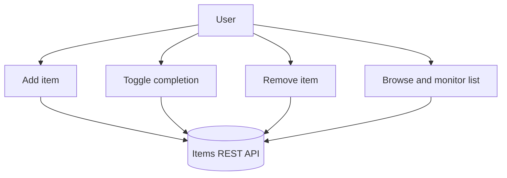
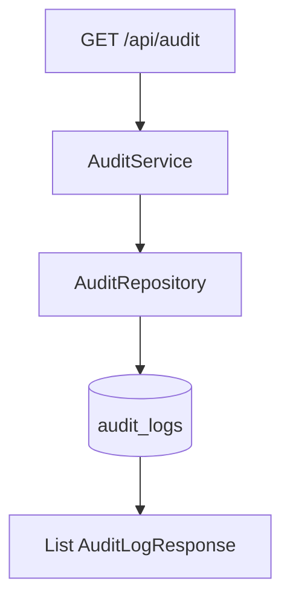
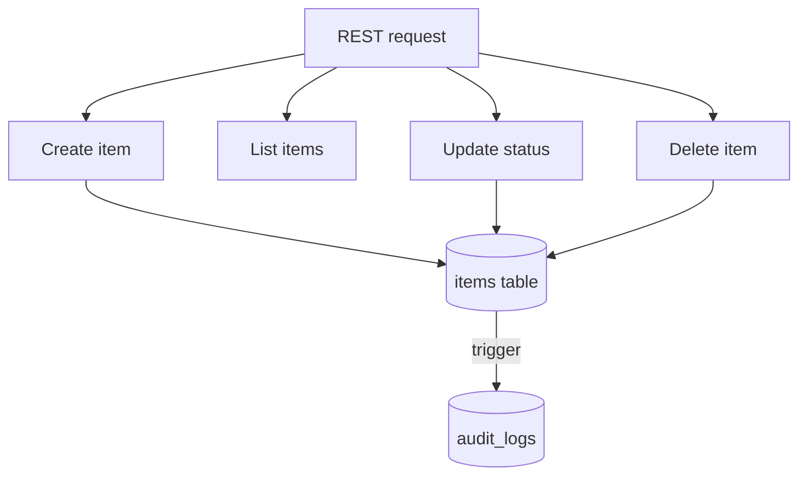
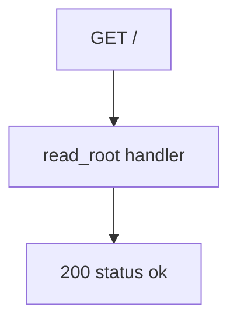

# KCE_Demo_Rebuild

## Functional Requirements Document

| | |
|---|---|
| **Version** | 1.0 |
| **Date** | June 26, 2026 |
| **Source** | Breeze.AI Functional Graph — 2 personas, 4 outcomes, 10 scenarios, 26 steps, 35 actions |

---

## Table of Contents

1. [Document Overview](#1-document-overview)
2. [Project Context](#2-project-context)
3. [Persona Summary](#3-persona-summary)
4. [FR-001 — User](#4-fr-001--user)
   - 4.1 [Manage Items](#user-manage-items)
5. [FR-002 — System](#5-fr-002--system)
   - 5.1 [Monitor System Audit Activity](#system-monitor-system-audit-activity)
   - 5.2 [Manage Items](#system-manage-items)
   - 5.3 [Monitor System Health](#system-monitor-system-health)
6. [Source Documents](#6-source-documents)
7. [Non-Functional Requirements](#7-non-functional-requirements)
8. [Glossary](#8-glossary)

---

## 1. Document Overview

KCE_Demo_Rebuild is a single-page item-management application backed by a layered FastAPI service over PostgreSQL. Users create, browse, toggle completion on, and delete items through a React front end that talks to a small REST API. The backend mirrors those operations as System-persona flows and adds an immutable audit trail: PostgreSQL triggers record every INSERT, UPDATE, and DELETE on the items table into an audit_logs table, exposed through a read-only audit endpoint. A health probe rounds out the surface.

The functional graph covers two personas (User, System), four outcomes, ten scenarios, and nine REST APIs. The design is deliberately thin: no authentication guards, query-parameter inputs, and trigger-driven auditing rather than application-level logging.

| | |
|---|---|
| **Personas** | 2 |
| **Outcomes** | 4 |
| **Scenarios** | 10 |
| **Steps** | 26 |
| **Actions** | 35 |

---

## 2. Project Context

### Key Business Objectives

1. Let users manage a list of items end to end (create, read, update status, delete)
2. Guarantee a tamper-evident audit trail for all item mutations via database triggers
3. Expose item operations through a small, predictable REST contract
4. Provide a health probe for uptime monitoring
5. Keep the stack thin and demonstrable for rebuild/reference purposes

### Key Stakeholders

| Role | Interest |
|------|----------|
| User | Fast, direct CRUD over items with immediate list refresh and visible completion state |
| System | Correct request handling, existence validation, persistence, and automatic audit capture |

### Key Capabilities

- Item creation with required name and description
- Paginated item retrieval
- Completion-status toggle with existence validation
- Item deletion with 404 guard
- Trigger-based audit logging of INSERT/UPDATE/DELETE
- Read-only audit log retrieval
- Backend health check

---

## 3. Persona Summary

| ID | Persona | Outcomes | Primary Responsibilities |
|----|---------|----------|--------------------------|
| FR-001 | User | 1 | The end user of the single-page app who manages items and monitors backend status and the item list. |
| FR-002 | System | 3 | The backend service that handles REST requests, validates and persists item data, and records audit entries via PostgreSQL triggers. |

---

## 4. FR-001 — User

The end user of the single-page app who manages items and monitors backend status and the item list.

### 4.1 Manage Items

Gives users a complete, self-service item workflow on one page, removing any dependency on backend operators for routine list management.

- **SC-01 Add a new item**

    User fills in a name and description in the creation form and submits. Both fields are trimmed and validated for non-empty content before the request is sent. On success the form clears and the item list refreshes.

    - **Step 1: Specify item details**
        - → Provide item name
        - → Provide item description
    - **Step 2: Submit the new item**
        - → Submit the new item
- **SC-02 Browse and monitor the item list**

    On page load the app checks backend health (GET /) and fetches all items (GET /api/items). Items display name, description, and completion state. An empty state shows 'No items found.'

    - **Step 1: Observe the application status**
        - → Observe the backend connection status
    - **Step 2: Review items in the list**
        - → Observe item name
        - → Observe item description
        - → Observe item completion state
- **SC-03 Update an item's completion status**

    User toggles completion status of a listed item. Active shows 'Complete', completed shows 'Undo'. Update is immediate and the list refreshes.

    - **Step 1: Indicate the desired completion state**
        - → Indicate whether to mark the item as complete or incomplete
    - **Step 2: Submit the completion status update**
        - → Submit the completion status update
- **SC-04 Remove an item from the list**

    User permanently removes a listed item. The list refreshes immediately after deletion.

    - **Step 1: Remove the item**
        - → Delete the item

---

## 5. FR-002 — System

The backend service that handles REST requests, validates and persists item data, and records audit entries via PostgreSQL triggers.

### 5.1 Monitor System Audit Activity

Surfaces the immutable audit trail so changes to tracked tables can be reviewed without direct database access.

- **SC-01 Retrieve audit log entries**

    AuditService.get_audit_logs(limit) delegates to AuditRepository.get_logs(limit), querying audit_logs ordered by created_at desc, limit default 50. No auth guard. Rows serialized to AuditLogResponse.

    - **Step 1: Receive request**
        - → Receive GET /api/audit
    - **Step 2: Query audit logs**
        - → Query audit log records
    - **Step 3: Return response**
        - → Serialize audit log response

---

### 5.2 Manage Items

Centralizes item CRUD with existence validation and automatic audit capture, so data integrity and traceability hold without extra application code.

- **SC-01 Create new item via POST API**

    POST /api/items with name and description query params. ItemService.create_item -> ItemRepository.create builds Item (completed=False), db.add+commit+refresh. PostgreSQL trigger inserts into audit_logs. Returns ItemResponse.

    - **Step 1: Receive item creation request**
        - → Receive POST /api/items
    - **Step 2: Validate input parameters**
        - → Validate name parameter
        - → Validate description parameter
    - **Step 3: Persist item and record audit trail**
        - → Persist new item to items table
        - → Insert audit log entry for item creation
        - → Return ItemResponse to caller
- **SC-02 Retrieve paginated item list**

    GET /api/items with optional skip (0) and limit (100). ItemService.get_items -> ItemRepository.get_all queries items with offset/limit. No auth. Returns List[ItemResponse].

    - **Step 1: Receive paginated item request**
        - → Receive GET /api/items
    - **Step 2: Query items from database**
        - → Query items
    - **Step 3: Serialize and return response**
        - → Return item list
- **SC-03 Update an item's completion status**

    PUT /api/items/{item_id} with completed (bool). Fetches item; 404 if absent. update_status sets completed, commit+refresh. PostgreSQL trigger logs UPDATE. Returns ItemResponse.

    - **Step 1: Receive update request**
        - → Receive PUT /api/items/{item_id}
    - **Step 2: Validate item existence**
        - → Query item by ID
        - → Reject missing item
    - **Step 3: Persist completion status update**
        - → Update item completion status
    - **Step 4: Return response**
        - → Return updated item
- **SC-04 Delete item by ID with existence validation**

    DELETE /api/items/{item_id}. Queries item; 404 if absent. Else db.delete+commit. PostgreSQL trigger logs DELETE. Returns 200 {status: ok}.

    - **Step 1: Receive delete request**
        - → Receive DELETE /api/items/{item_id}
    - **Step 2: Validate item existence**
        - → Query item by ID
        - → Reject missing item
    - **Step 3: Delete item record**
        - → Delete item from items table
        - → Insert audit log entry via database trigger
    - **Step 4: Return success response**
        - → Return deletion confirmation

---

### 5.3 Monitor System Health

Provides a dependency-free liveness signal for uptime monitoring and deployment checks.

- **SC-01 Respond to backend health check request**

    GET / with no params, no auth, no dependencies. Returns {status: ok, message: 'Backend API is running!'} HTTP 200. No branches. Handler read_root() in routes.py.

    - **Step 1: Receive health check request**
        - → Receive GET /
    - **Step 2: Return health status**
        - → Return health status response

---

## 6. Source Documents

*No source documents referenced.*

---

## 7. Non-Functional Requirements

*Non-functional requirements should be defined based on the project's specific needs.*

---

## 8. Glossary

*Glossary terms should be defined based on the project's domain vocabulary.*

---

*Generated on June 26, 2026 by Breeze.AI*
